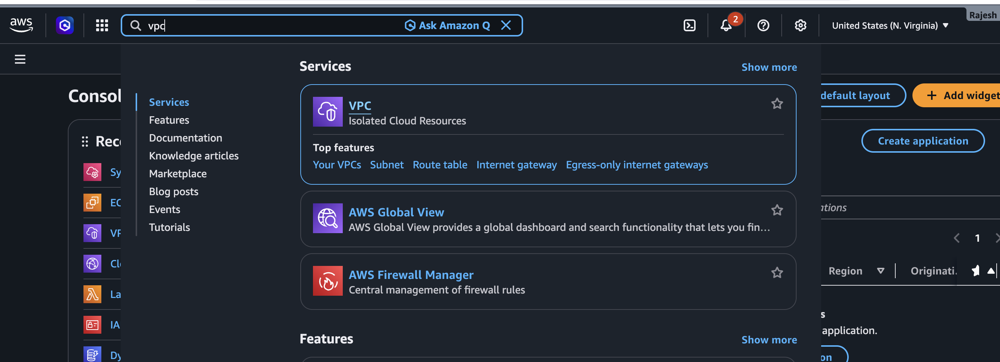
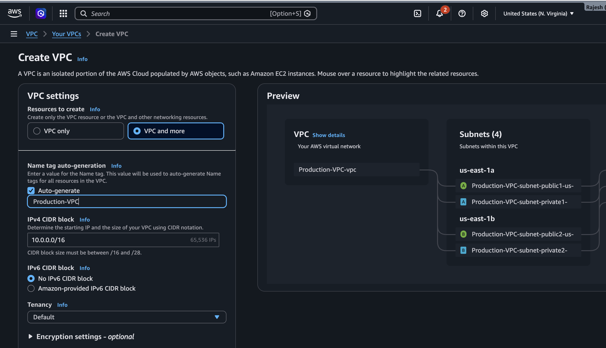
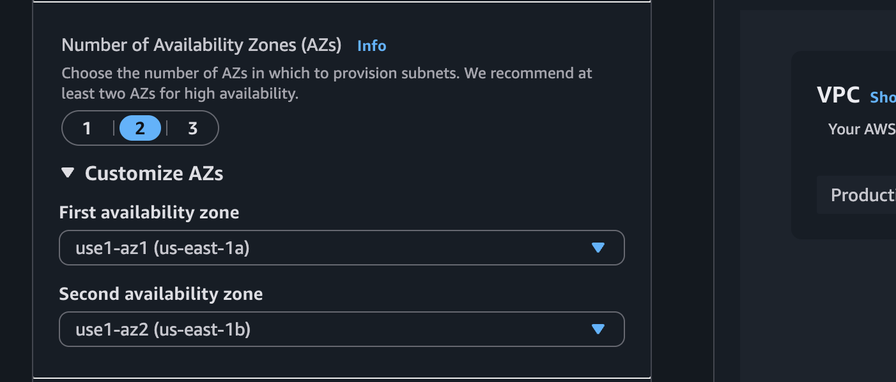
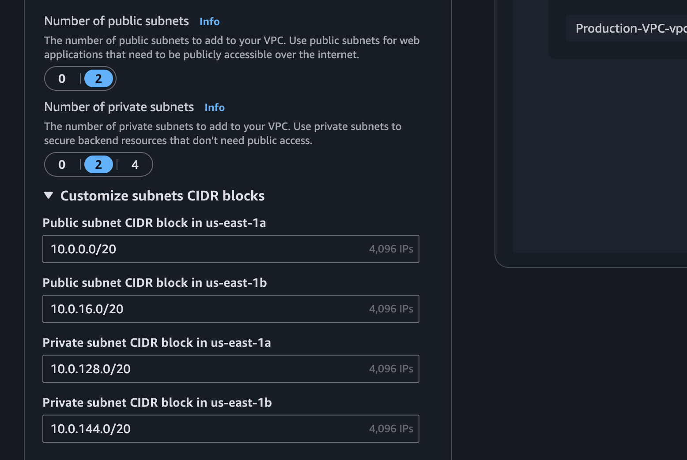
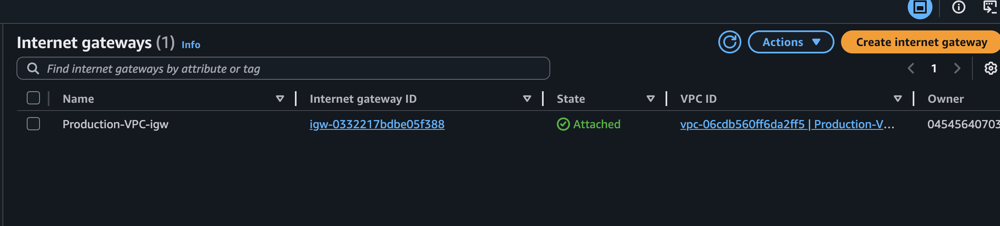
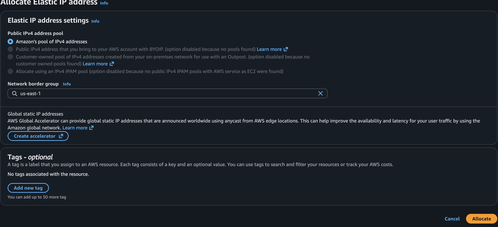
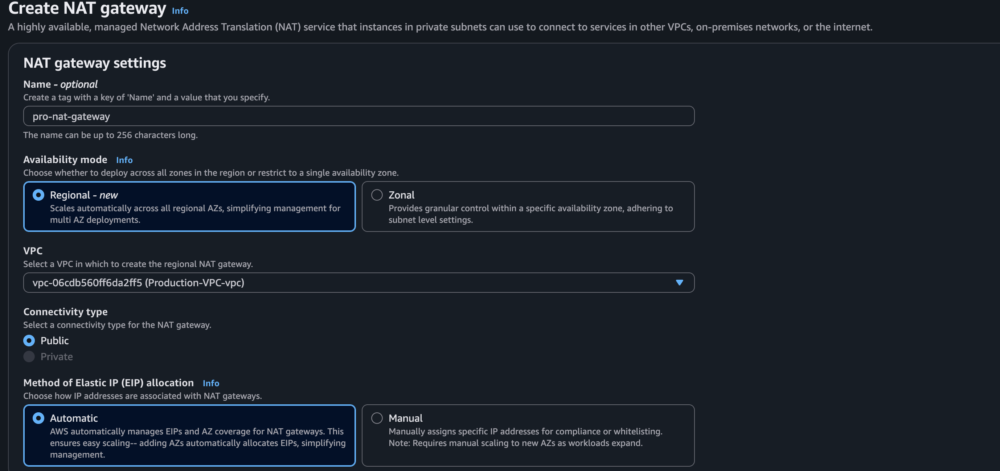
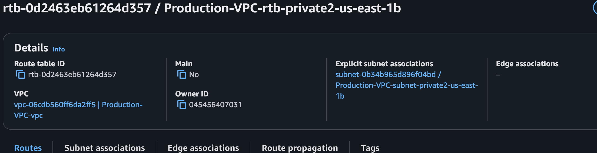
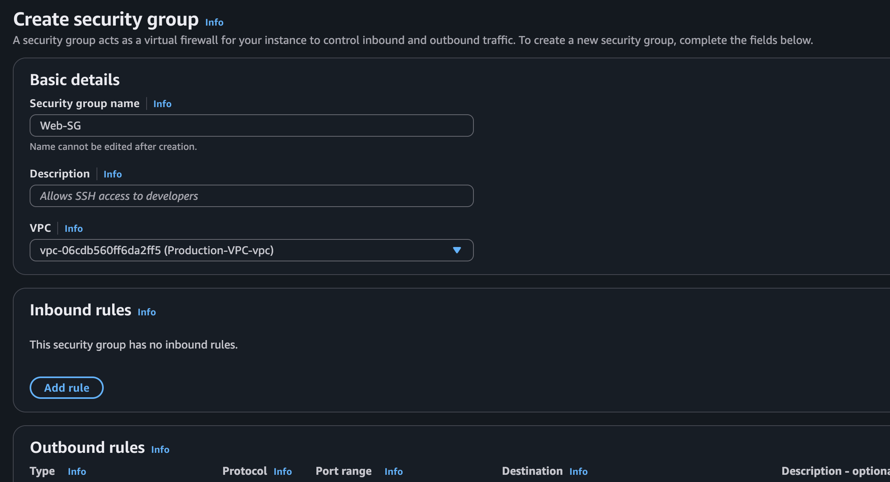
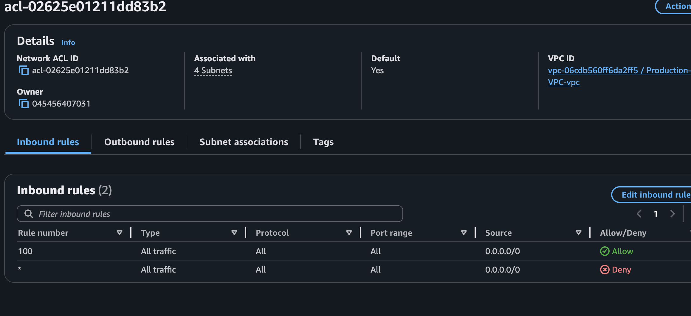

# VPC Creation on AWS Cloud

Based on the requirement, plan and create an AWS VPC architecture.

## Requirement

```text
VPC
├── 2 Public Subnets
├── 2 Private Subnets
├── Internet Gateway
├── NAT Gateway
├── Route Tables
├── Security Groups
├── NACLs
├── Multi-AZ Architecture
└── Internet Access for Public & Private Resources
```

---

After planning the VPC architecture based on the requirements, log in to the AWS Management Console and search for **VPC**.



---

# Create VPC

## Steps

```text
Open AWS Management Console
→ Search for VPC
→ Click Create VPC

Name
Production-VPC

IPv4 CIDR
10.0.0.0/16

IPv6 CIDR
Optional

Tenancy
Default

Number of Availability Zones (AZs)
2

Number of Public Subnets
2

Number of Private Subnets
2

Click Create VPC
```




---

# CIDR Planning

Create four subnets within the VPC by dividing the VPC CIDR block into smaller subnet CIDRs.

## Subnets

```text
Public-Subnet-A    10.0.1.0/24
Public-Subnet-B    10.0.2.0/24

Private-Subnet-A   10.0.3.0/24
Private-Subnet-B   10.0.4.0/24
```

---

# Create Public Subnets

Create two Public Subnets in different Availability Zones to provide high availability.

## Steps

```text
AWS Console
→ VPC
→ Subnets
→ Create Subnet
```

### Public Subnet A

```text
Name
Public-Subnet-A

Availability Zone
ap-south-1a

IPv4 CIDR
10.0.1.0/24

Auto-Assign Public IPv4 Address
Enable
```

### Public Subnet B

```text
Name
Public-Subnet-B

Availability Zone
ap-south-1b

IPv4 CIDR
10.0.2.0/24

Auto-Assign Public IPv4 Address
Enable
```

---

# Create Private Subnets

Create two Private Subnets in different Availability Zones.

## Steps

```text
AWS Console
→ VPC
→ Subnets
→ Create Subnet
```

### Private Subnet A

```text
Name
Private-Subnet-A

Availability Zone
ap-south-1a

IPv4 CIDR
10.0.3.0/24

Auto-Assign Public IPv4 Address
Disable
```

### Private Subnet B

```text
Name
Private-Subnet-B

Availability Zone
ap-south-1b

IPv4 CIDR
10.0.4.0/24

Auto-Assign Public IPv4 Address
Disable
```

## 

# Create Internet Gateway

Create an Internet Gateway and attach it to the VPC to provide internet connectivity for resources in the Public Subnets.

## Steps

```text
AWS Console
→ VPC
→ Internet Gateways
→ Create Internet Gateway

Name
Production-IGW

Click Attach to VPC

Select VPC
Production-VPC
```

## 

# Create Public Route Table

Create a Public Route Table and associate it with the Public Subnets to enable internet access through the Internet Gateway.

## Steps

```text
AWS Console
→ VPC
→ Route Tables
→ Create Route Table

Name
Public-RT

VPC
Production-VPC

Click Create Route Table
```

### Add Route

```text
Destination
0.0.0.0/0

Target
Internet Gateway (Production-IGW)
```

### Associate Public Subnets

```text
Public-Subnet-A

Public-Subnet-B
```

---

# Allocate an Elastic IP

Allocate an Elastic IP Address that will be associated with the NAT Gateway.

## Steps

```text
AWS Console
→ EC2
→ Elastic IPs
→ Allocate Elastic IP Address

Allocate
1 Elastic IP
```

## 

# Create a NAT Gateway

Create a NAT Gateway in a Public Subnet to provide outbound internet access for resources in the Private Subnets.

## Steps

```text
AWS Console
→ VPC
→ NAT Gateways
→ Create NAT Gateway

Name
Production-NAT

Subnet
Public-Subnet-A

Elastic IP
Select the Allocated Elastic IP

Click Create NAT Gateway
```

## 

# Create a Private Route Table

Create a Private Route Table and associate it with the Private Subnets.

## Steps

```text
AWS Console
→ VPC
→ Route Tables
→ Create Route Table

Name
Private-RT

VPC
Production-VPC

Click Create Route Table
```

### Add Route

```text
Destination
0.0.0.0/0

Target
Production-NAT
```

### Associate Private Subnets

```text
Private-Subnet-A

Private-Subnet-B
```

## 

# Create a Security Group

Create a Security Group for the web servers.

## Steps

```text
AWS Console
→ EC2
→ Security Groups
→ Create Security Group

Name
Web-SG

Inbound Rules

HTTP (80)      Anywhere
HTTPS (443)    Anywhere
SSH (22)       Your IP

Outbound Rules

Allow All
```

## 

# Create a Network ACL

Create a Network ACL and associate it with the Public Subnets.

## Steps

```text
AWS Console
→ VPC
→ Network ACLs
→ Create Network ACL
```

### Inbound Rules

```text
100  Allow  HTTP
110  Allow  HTTPS
120  Allow  SSH
```

### Outbound Rules

```text
100  Allow  All Traffic
```

### Associate Subnets

```text
Public-Subnet-A

Public-Subnet-B
```



---

# Cost Optimization

Instead of routing Amazon S3 traffic through a NAT Gateway:

```text
Private EC2
      |
NAT Gateway
      |
S3
```

Create an **S3 Gateway Endpoint**.

```text
Private EC2
      |
S3 Gateway Endpoint
      |
S3 Bucket
```

### Benefits

```text
Lower Cost
Private Access
No NAT Gateway Charges
Traffic Stays Within the AWS Network
```
