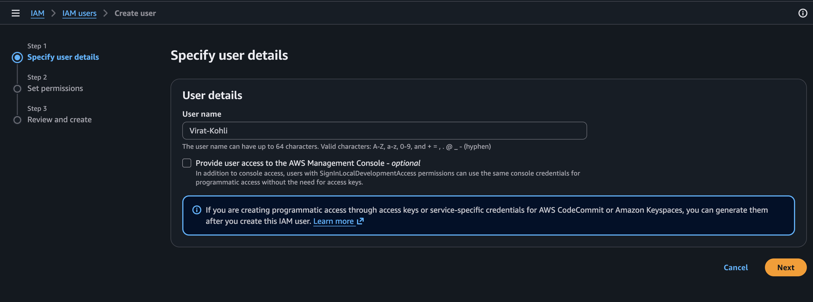
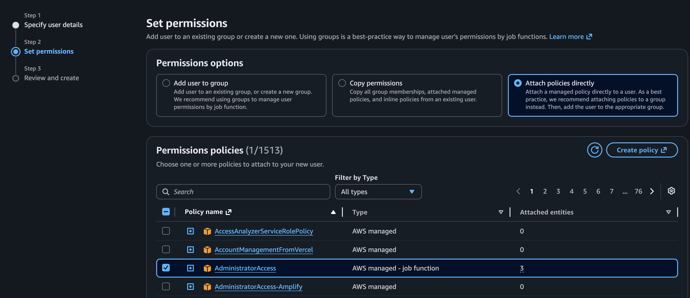
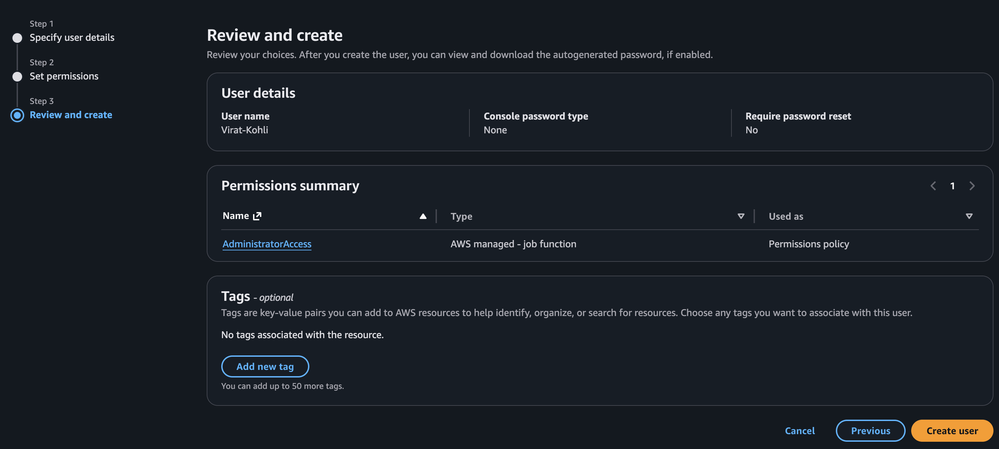
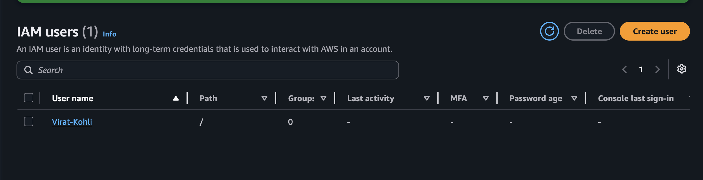

# 👤 Create an AWS IAM User

This guide explains how to create an **IAM User** in the **AWS Management Console**. IAM users allow you to securely grant access to AWS resources without sharing your Root User credentials.

---

# 📋 Prerequisites

Before creating an IAM user, ensure that:

- You have an active AWS account.
- You have access to the AWS Root User.
- Multi-Factor Authentication (MFA) is enabled for the Root User (recommended).

---

# 🔵 Step 1: Sign in to the AWS Management Console

Sign in to the **AWS Management Console** using your **Root User** credentials.

> **Note:** AWS recommends using the Root User only for account-level administrative tasks. Create IAM users for everyday access.

---

# 🔵 Step 2: Open the IAM Service

1. After signing in, navigate to the AWS Management Console.
2. Search for **IAM** using the search bar.
3. Select **IAM (Identity and Access Management)** from the search results.

---

# 🔵 Step 3: Create a New IAM User

1. In the left navigation pane, click **Users**.
2. Click **Create user**.
3. Enter a unique **User name**.
4. (Optional) Enable **Provide user access to the AWS Management Console** if the user needs web console access.

> Enable console access only if the user needs to sign in through the AWS Management Console.

# 🔵 Step 4: Configure User Permissions

Choose one of the following permission options based on your requirements:

- **Add user to group** _(Recommended)_
- **Copy permissions**
- **Attach policies directly**

> **Best Practice:** Use **Add user to group** whenever possible. Managing permissions through groups is easier, more secure, and follows AWS best practices.

---

# 🔵 Step 5: Review and Create the User

Review all the user details, including:

- User Name
- Console Access (if enabled)
- Permission Configuration

If everything is correct, click **Create user**.

AWS will create the IAM user successfully.

# 🔵 Step 6: Verify the IAM User

1. Navigate back to **IAM → Users**.
2. Confirm that the newly created IAM user appears in the Users list.
3. Click the user name to view its details, permissions, groups, security credentials, and other settings.

# 🔵 Best Practices

- Never use the Root User for daily operations.
- Enable MFA for all IAM users.
- Follow the Principle of Least Privilege.
- Assign permissions through IAM Groups whenever possible.
- Regularly review and remove unused IAM users.
- Rotate access keys periodically if programmatic access is enabled.

---

# 🔵 Conclusion

You have successfully created an IAM User in AWS. IAM users provide secure, controlled access to AWS resources while helping you follow AWS security best practices and avoid using the Root User for everyday tasks.
