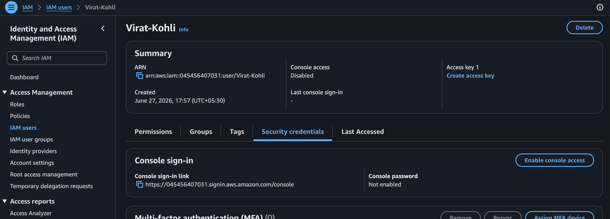
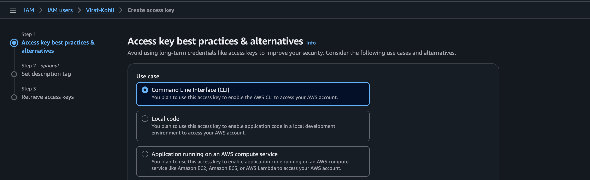
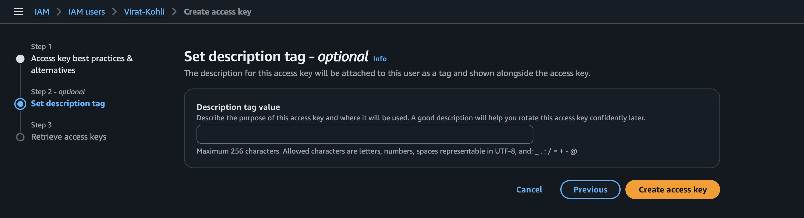
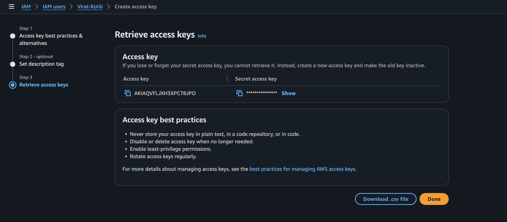
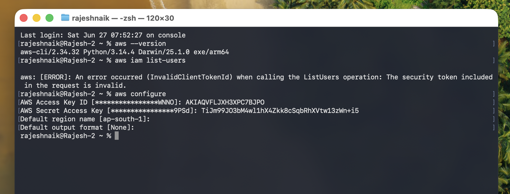

# 🔵 AWS CLI Configuration

Before using the AWS CLI, you must configure it with credentials that allow programmatic access to your AWS account.

---

# 🔵 Before Configuring AWS CLI

Before running the `aws configure` command, complete the following steps:

- Log in to the AWS Management Console.
- Open the **IAM** service.
- Create an IAM User.
- Attach the required permissions (for this example, the user should have permission to create and manage S3 buckets).
- Generate an **Access Key** for the IAM user.
- Save the following credentials securely:
  - **Access Key ID**
  - **Secret Access Key**






These credentials will be used by the AWS CLI to authenticate your requests.

---

# 🔵 Configure AWS CLI

Open your terminal or command prompt and run:

```bash
aws configure
```

AWS CLI will prompt you to enter the following information:

```text
AWS Access Key ID [None]:
AWS Secret Access Key [None]:
Default region name [None]:
Default output format [None]:
```

Example:

```text
AWS Access Key ID [None]: ABC123EXAMPLEKEY
AWS Secret Access Key [None]: XYZ123EXAMPLESECRET
Default region name [None]: us-east-1
Default output format [None]: json
```

Once completed, AWS CLI stores these values in the local configuration files and uses them for all future AWS CLI commands.

---

# 🔵 Verify AWS CLI Configuration

After configuring the AWS CLI, verify that the correct IAM user is authenticated.

Run:

```bash
aws sts get-caller-identity
```

Example Output:

```json
{
  "UserId": "AIDAXXXXXXXXXXXXX",
  "Account": "123456789012",
  "Arn": "arn:aws:iam::123456789012:user/demo-user"
}
```

This command confirms:

- The authenticated IAM user
- AWS Account ID
- IAM User ARN
- Successful AWS CLI configuration



# 🔵 Demo Project - Create an S3 Bucket and Upload a Local Folder Using AWS CLI

This demo project creates an S3 bucket and uploads a local folder using a Shell Script and AWS CLI.

---

# 🔵 Prerequisites

Before running the script, ensure the following requirements are met:

- AWS CLI is installed.
- AWS CLI is configured using `aws configure`.
- The IAM user has permission to create and manage S3 buckets.
- A local folder exists that you want to upload.
- The S3 bucket name is globally unique.

---

# 🔵 Create the Shell Script

Create a new shell script file:

```bash
vi s3-upload.sh
```

---

# 🔵 Add the Following Script

```bash
#!/bin/bash

# Variables
BUCKET_NAME="<unique_s3_bucket_name>"
REGION="us-east-1"
LOCAL_FOLDER="<local_folder_path>"

echo "Creating S3 Bucket..."

aws s3api create-bucket \
  --bucket "$BUCKET_NAME" \
  --region "$REGION"

if [ $? -eq 0 ]; then
    echo "Bucket Created Successfully"
else
    echo "Bucket Creation Failed"
    exit 1
fi

echo "Uploading Folder to S3..."

aws s3 sync "$LOCAL_FOLDER" "s3://$BUCKET_NAME/"

if [ $? -eq 0 ]; then
    echo "Folder Uploaded Successfully"
else
    echo "Upload Failed"
    exit 1
fi

echo "Listing Uploaded Files..."

aws s3 ls "s3://$BUCKET_NAME/" --recursive

echo "Script Completed Successfully"
```

---

# 🔵 Make the Script Executable

Grant execute permission to the script.

```bash
chmod +x s3-upload.sh
```

---

# 🔵 Execute the Script

Run the shell script.

```bash
./s3-upload.sh
```

The script performs the following operations automatically:

1. Creates a new S3 bucket.
2. Uploads the specified local folder to the bucket.
3. Lists all uploaded files.
4. Displays a success message after completion.

---

# 🔵 Verify the S3 Bucket Using AWS CLI

To list all S3 buckets in your AWS account, run:

```bash
aws s3 ls
```

To list all uploaded files inside the bucket:

```bash
aws s3 ls s3://<unique_s3_bucket_name>/ --recursive
```

---

# 🔵 Verify Using the AWS Management Console

You can also verify the upload using the AWS Management Console.

Steps:

1. Log in to the AWS Management Console.
2. Open the **Amazon S3** service.
3. Select the newly created bucket.
4. Verify that all files from the local folder have been uploaded successfully.


---

# 🔵 Expected Outcome

After completing this demo:

- AWS CLI is successfully configured.
- IAM user authentication is verified.
- A new S3 bucket is created.
- Local files are uploaded to the S3 bucket.
- Uploaded objects are verified using both AWS CLI and the AWS Management Console.

---

# 🔵 Deploy an S3 Bucket and Upload a Local Folder Using Python (AWS CLI) - with Python

This example demonstrates how to use **Python** to execute **AWS CLI commands** for creating an Amazon S3 bucket and uploading a local folder.

Instead of writing shell commands manually, Python uses the `subprocess` module to invoke AWS CLI commands.

---

# 🔵 Create the Python File

Create a new Python file:

```bash
vi deploy.py
```

---

# 🔵 Add the Following Python Script

```python
import subprocess
import sys

# Variables
bucket_name = "<unique_s3_bucket_name>"
region = "us-east-1"
local_folder = "<local_folder_path>"

print("Creating S3 Bucket...")

# Create S3 Bucket
result = subprocess.run([
    "aws",
    "s3api",
    "create-bucket",
    "--bucket",
    bucket_name,
    "--region",
    region
])

if result.returncode != 0:
    print("Bucket Creation Failed")
    sys.exit(1)

print("Bucket Created Successfully")

print("Uploading Folder to S3...")

# Upload Local Folder
result = subprocess.run([
    "aws",
    "s3",
    "sync",
    local_folder,
    f"s3://{bucket_name}/"
])

if result.returncode != 0:
    print("Upload Failed")
    sys.exit(1)

print("Folder Uploaded Successfully")

print("Listing Uploaded Files...")

# List Uploaded Files
subprocess.run([
    "aws",
    "s3",
    "ls",
    f"s3://{bucket_name}/",
    "--recursive"
])

print("Deployment Completed Successfully")
```

---

# 🔵 Run the Python Script

Execute the script:

```bash
python3 deploy.py
```

---

# 🔵 What the Script Does

The Python script performs the following operations:

1. Creates a new Amazon S3 bucket.
2. Uploads the specified local folder to the S3 bucket.
3. Lists all uploaded files inside the bucket.
4. Displays a success message after completion.

---

# 🔵 Verify the S3 Bucket Using AWS CLI

List all S3 buckets:

```bash
aws s3 ls
```

List all uploaded files inside the bucket:

```bash
aws s3 ls s3://<unique_s3_bucket_name>/ --recursive
```

---

# 🔵 Verify Using the AWS Management Console

You can also verify the deployment using the AWS Management Console.

Steps:

1. Log in to the AWS Management Console.
2. Open the **Amazon S3** service.
3. Select the newly created bucket.
4. Verify that all files from the local folder have been uploaded successfully.

---

# 🔵 Deploy an S3 Bucket and Upload a Local Folder Using Boto3

**Boto3** is the official **AWS SDK (Software Development Kit) for Python**. It allows Python applications to interact directly with AWS services without executing AWS CLI commands.

Unlike the previous example, which uses the `subprocess` module to call AWS CLI commands, Boto3 communicates directly with AWS APIs, making applications faster, more efficient, and better suited for production environments.

With Boto3, you can:

- Create and manage AWS resources directly from Python.
- Upload, download, and delete S3 objects.
- Manage EC2, IAM, Lambda, DynamoDB, CloudWatch, and many other AWS services.
- Build automation scripts and cloud-native applications.
- Eliminate the dependency on AWS CLI commands.

Boto3 automatically uses the AWS credentials configured through `aws configure` or IAM Roles when running on AWS services such as EC2, ECS, or Lambda.
