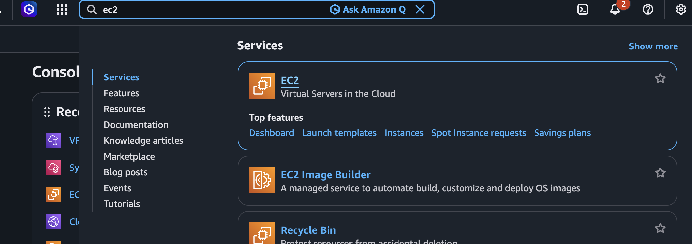
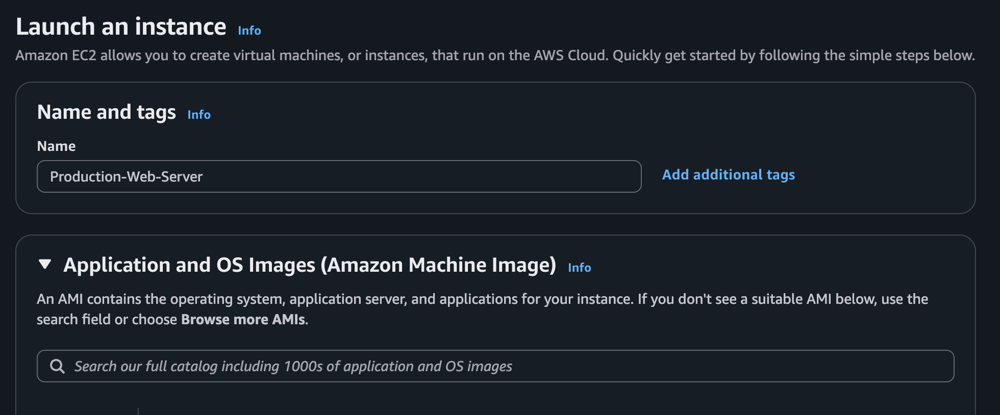
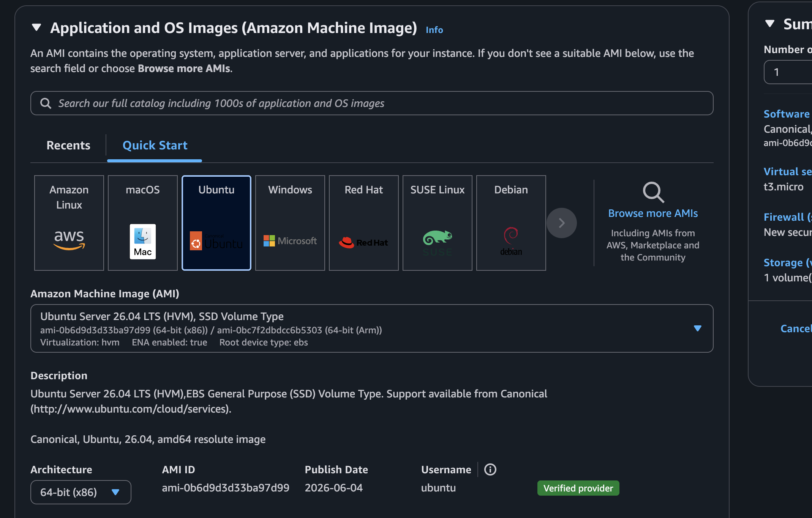
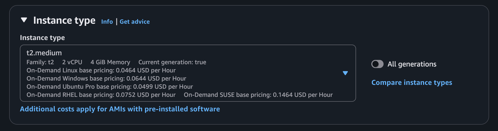
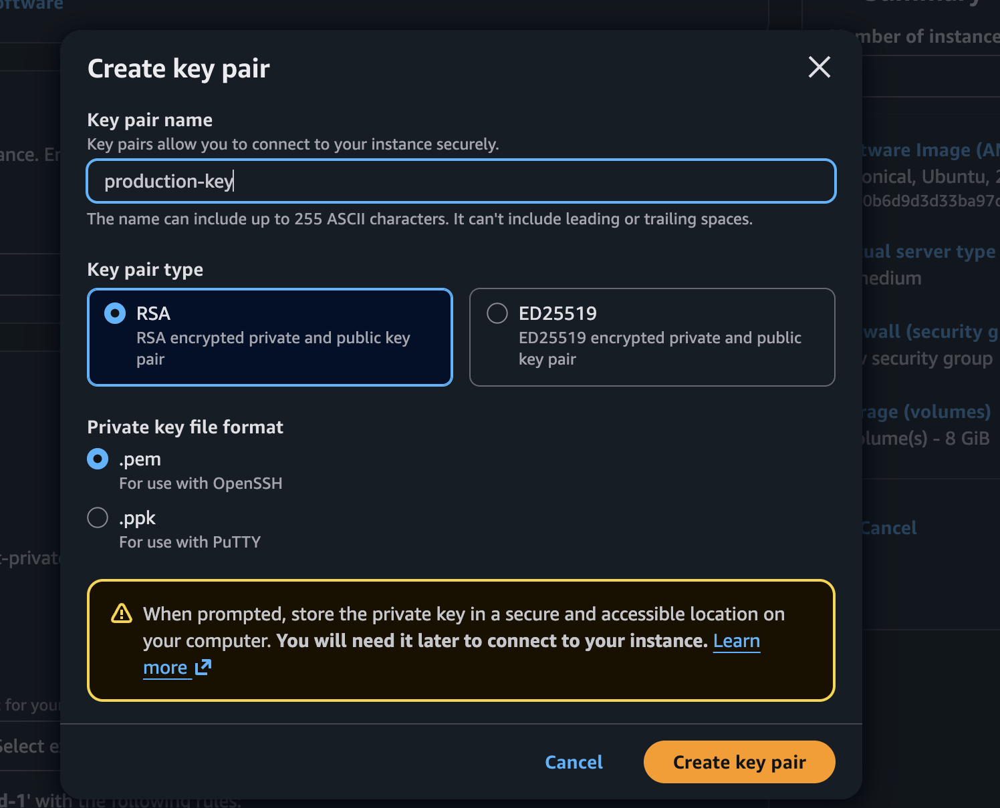
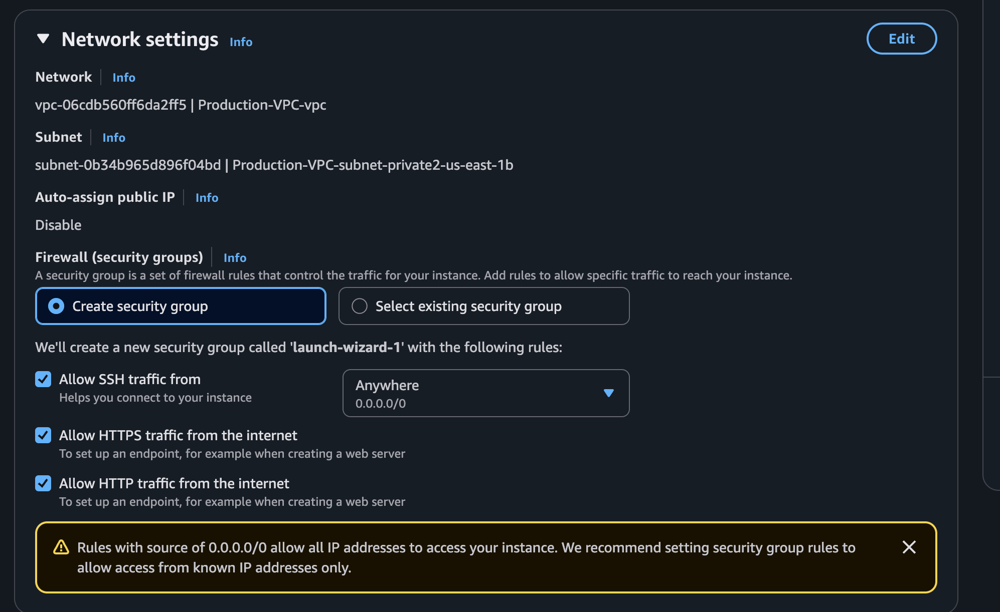
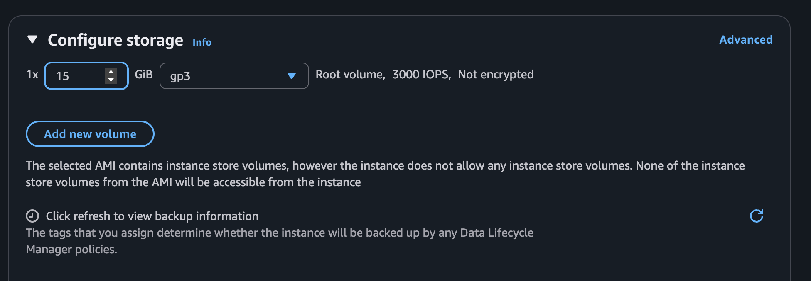

# Launching an Amazon EC2 Instance

Amazon EC2 allows you to create virtual servers in the AWS Cloud within a few minutes. Before launching an instance, you need to choose an operating system, hardware configuration, storage, networking, security settings, and access credentials. Once launched, the instance can be used to host websites, APIs, backend applications, databases, and many other workloads.

This guide walks through the complete process of launching and configuring an EC2 instance following production-oriented best practices.

---

# 🔵 Step 1: Open the EC2 Console

Sign in to your AWS Management Console and navigate to the EC2 service.

```
AWS Management Console
        ↓
Services
        ↓
EC2
        ↓
Launch Instance
```

The **Launch Instance** wizard allows you to configure every aspect of your virtual server before it is created.



---

# 🔵 Step 2: Provide an Instance Name

The first step is to assign a meaningful name to your EC2 instance.

A descriptive naming convention makes it easier to identify servers when managing multiple environments such as Development, Testing, Staging, and Production.

Example:

```text
Production-Web-Server
```

Recommended naming convention:

```text
<Project>-<Environment>-<Purpose>

Examples

Inventory-Development-App
ERP-Staging-Backend
```



---

# 🔵 Step 3: Select an Amazon Machine Image (AMI)

An **Amazon Machine Image (AMI)** is a pre-configured operating system template used to launch an EC2 instance.

The AMI determines:

- Operating System
- Installed Software
- Default User
- System Configuration

Common AMIs include:

```text
Amazon Linux 2023
Ubuntu Server 24.04 LTS
Red Hat Enterprise Linux
Windows Server 2025
Debian
```

### Choosing the Right AMI

- **Amazon Linux** – Best for AWS-native workloads.
- **Ubuntu** – Popular for web development and open-source applications.
- **Windows Server** – Required for Microsoft-based applications.
- **Red Hat** – Enterprise Linux environments.

For this guide, select:

```text
Ubuntu Server 24.04 LTS
```



---

# 🔵 Step 4: Choose an Instance Type

The instance type defines the hardware resources allocated to your virtual server.

It determines:

- Number of vCPUs
- Memory (RAM)
- Network Performance
- Storage Performance

Examples:

| Instance Type | Suitable For                  |
| ------------- | ----------------------------- |
| t2.micro      | AWS Free Tier, Learning       |
| t3.micro      | Small Applications            |
| t3.medium     | Development Servers           |
| m5.large      | Production Applications       |
| c7g.large     | Compute Intensive Workloads   |
| r6i.large     | Memory Intensive Applications |

For learning purposes:

```text
t2.micro
```



---

# 🔵 Step 5: Create a Key Pair

A **Key Pair** is used to securely connect to Linux EC2 instances using SSH authentication.

AWS generates:

- Public Key
- Private Key (.pem)

Create a new key pair.

Example:

```text
Name:
production-key

Format:
.pem

Type:
RSA
```

Download the private key immediately and store it securely.

> AWS does not allow the private key to be downloaded again after creation.



---

# 🔵 Step 6: Configure Network Settings

Every EC2 instance must be launched inside a Virtual Private Cloud (VPC).

Configure the following:

- VPC
- Subnet
- Auto Assign Public IP
- Security Group

Example:

```text
VPC
Default VPC

Subnet
Public Subnet

Auto Assign Public IP
Enabled
```

If the instance needs internet access, ensure that:

- The subnet is public.
- An Internet Gateway is attached to the VPC.
- The route table contains a route to the Internet Gateway.



---

# 🔵 Step 7: Configure the Security Group

A **Security Group** acts as a virtual firewall for your EC2 instance.

It controls which inbound and outbound traffic is allowed.

Example inbound rules:

| Port | Protocol | Purpose        |
| ---- | -------- | -------------- |
| 22   | SSH      | Remote Login   |
| 80   | HTTP     | Website        |
| 443  | HTTPS    | Secure Website |

Avoid allowing SSH access from anywhere (`0.0.0.0/0`) in production. Instead, restrict it to trusted IP addresses.

---

# 🔵 Step 8: Configure Storage

Every EC2 instance requires a root storage volume.

AWS creates an **Amazon EBS Volume** that stores:

- Operating System
- Installed Software
- User Data
- Configuration Files

Example:

```text
Root Volume

Type:
gp3

Size:
20 GB
```

You can increase the storage size later without recreating the instance.



---

# 🔵 Step 9: Add a User Data Script

**User Data** allows you to automate server configuration during the first boot.

This process is called **Bootstrapping**.

Typical tasks include:

- Updating packages
- Installing software
- Downloading source code
- Configuring services
- Starting applications

Example:

```bash
#!/bin/bash

sudo apt update -y
sudo apt install nginx -y
sudo systemctl enable nginx
sudo systemctl start nginx
```

When the instance starts, Nginx is installed automatically without manual intervention.

---

# 🔵 Step 10: Attach an IAM Role

Instead of storing AWS credentials inside your application, attach an IAM Role to the EC2 instance.

The IAM Role provides temporary credentials that allow the instance to securely access AWS services.

Example:

```text
EC2-S3-Access-Role
```

Typical permissions include:

- Read and Write to Amazon S3
- Publish Logs to CloudWatch
- Retrieve Secrets from Secrets Manager
- Access Systems Manager (SSM)

Using IAM Roles is an AWS security best practice.

---

# 🔵 Step 11: Add Resource Tags

Tags help organize and manage AWS resources.

They are especially useful for:

- Billing
- Automation
- Cost Allocation
- Searching Resources

Example:

```text
Name = Production-Web-Server
Environment = Production
Application = ChemicalToday
Owner = DevOps
```

---

# 🔵 Step 12: Launch the Instance

Review all configuration settings carefully.

Click:

```text
Launch Instance
```

AWS provisions the virtual machine, installs the selected operating system, attaches storage, configures networking, and starts the instance.

Within a few minutes, the instance status changes to:

```text
Running
```

---

# 🔵 Step 13: Connect to the EC2 Instance

After the instance is running, connect using SSH.

Example:

```bash
chmod 400 production-key.pem

ssh -i production-key.pem ubuntu@PUBLIC-IP
```

Default usernames:

| Operating System | Username |
| ---------------- | -------- |
| Ubuntu           | ubuntu   |
| Amazon Linux     | ec2-user |
| Debian           | admin    |
| CentOS           | centos   |

---

# 🔵 Step 14: Verify the Application

Open a browser and enter the instance's public IP address.

```
http://PUBLIC-IP
```

If Nginx was installed successfully, the default welcome page should appear.

You can also verify from the terminal:

```bash
systemctl status nginx
```

---

# 🔵 Step 15: Allocate an Elastic IP

By default, an EC2 instance receives a dynamic public IP address that changes when the instance is stopped and started.

To keep a permanent public IP, allocate an **Elastic IP**.

```
EC2
    ↓
Elastic IPs
    ↓
Allocate Elastic IP
    ↓
Associate with Instance
```

This ensures your server remains accessible using the same public IP.

---

# 🔵 Step 16: Create an AMI Backup

After configuring the server, create an AMI.

```
EC2
    ↓
Select Instance
    ↓
Actions
    ↓
Image and Templates
    ↓
Create Image
```

The AMI can later be used to launch identical EC2 instances.

---

# 🔵 Step 17: Create an EBS Snapshot

Snapshots provide backups of your EBS volumes.

```
EC2
    ↓
Elastic Block Store
    ↓
Volumes
    ↓
Create Snapshot
```

Snapshots are incremental and stored securely by AWS.

They are useful for:

- Backup
- Disaster Recovery
- Volume Restoration
- Cross-Region Copy

---

# 🔵 Step 18: Monitor the Instance

Use Amazon CloudWatch to monitor the health and performance of your EC2 instance.

Common metrics include:

- CPU Utilization
- Network In
- Network Out
- Disk Read Operations
- Disk Write Operations
- Status Checks

CloudWatch alarms can notify you when resource usage exceeds defined thresholds.

---

# 🔵 Step 19: Configure Auto Scaling

For production workloads, configure Auto Scaling to automatically adjust the number of EC2 instances based on demand.

First create:

```text
Launch Template
```

Then create:

```text
Auto Scaling Group
```

Example:

```text
Minimum Capacity : 2

Desired Capacity : 2

Maximum Capacity : 10
```

Auto Scaling helps improve availability while reducing infrastructure costs.

---

# 🔵 Step 20: Attach an Application Load Balancer

To distribute incoming traffic across multiple EC2 instances, create an **Application Load Balancer (ALB)**.

```
Application Load Balancer
        ↓
Target Group
        ↓
Auto Scaling Group
```

Benefits include:

- High Availability
- Fault Tolerance
- Health Checks
- Even Traffic Distribution
- Zero Downtime Deployments

This architecture is commonly used in production environments to ensure applications remain available even if one or more EC2 instances fail.

---

# 🔵 Summary

Launching an EC2 instance involves much more than simply creating a virtual machine. A production-ready server should include secure networking, properly configured storage, IAM Roles, Security Groups, automated bootstrapping, monitoring, backups, Auto Scaling, and a Load Balancer. Following these best practices ensures your applications are secure, scalable, reliable, and easy to manage in AWS.
