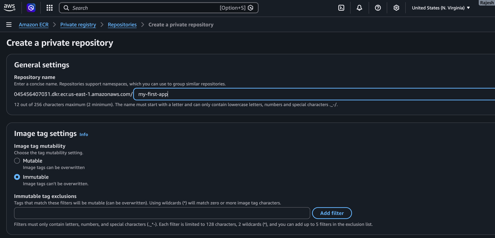
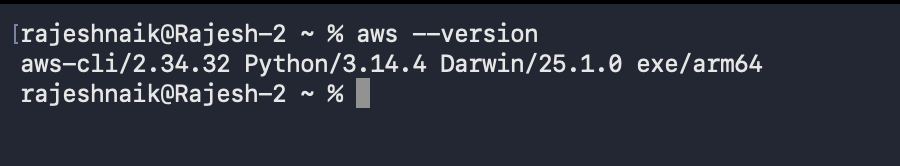
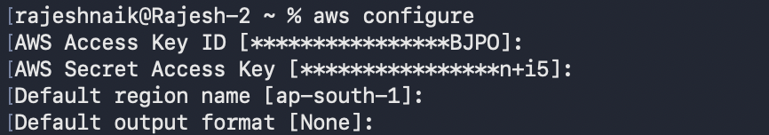
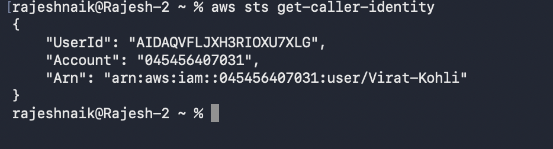
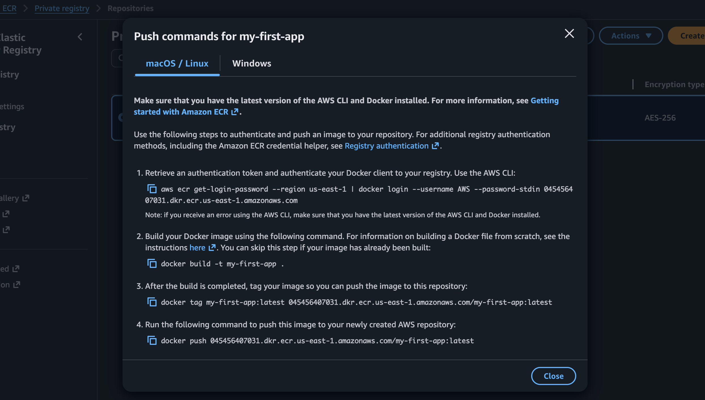

# 🔵 Amazon ECR Practical Demo

Now that we've understood the theory behind Amazon ECR, let's learn how to use it practically.

In this section, you'll learn how to:

- Create an ECR repository
- Configure AWS CLI
- Authenticate Docker with Amazon ECR
- Build a Docker image
- Tag the Docker image
- Push the image to Amazon ECR
- Verify the uploaded image
- Pull the image from Amazon ECR

By the end of this tutorial, you'll understand the complete workflow used in real-world DevOps projects.

---

# 🔵 Step 1: Create an Amazon ECR Repository

Log in to the AWS Management Console.

Navigate to:

```text
AWS Console
      │
      ▼
Amazon ECR
```

Click **Create Repository**.

Choose the repository visibility.

- Private (Recommended)
- Public

For production environments, choose **Private Repository**.

Provide a repository name.

Example:

```text
my-first-app
```

Optionally enable:

- Image Scanning
- Tag Immutability

Click **Create Repository**.

Your repository is now ready to store Docker images.



---

# 🔵 Step 2: Install AWS CLI

AWS CLI allows your local machine to communicate with AWS services from the command line.

Without AWS CLI, Docker cannot authenticate with Amazon ECR.

Verify installation:

```bash
aws --version
```

Example output:

```text
aws-cli/2.xx.x
```

If this command works, AWS CLI is installed.



---

# 🔵 Step 3: Configure AWS CLI

Configure AWS CLI using:

```bash
aws configure
```

AWS CLI asks for:

```text
AWS Access Key ID

AWS Secret Access Key

Default Region

Output Format
```

## After configuration, AWS CLI stores these credentials securely on your local machine.

## What does `aws configure` do?

It saves your AWS credentials locally so AWS CLI commands can authenticate with your AWS account.

Without this step, AWS CLI cannot access Amazon ECR.



---

# 🔵 Step 4: Verify AWS CLI Authentication

Run:

```bash
aws sts get-caller-identity
```

Example output:

```json
{
  "UserId": "...",
  "Account": "...",
  "Arn": "..."
}
```

### What does this command do?

This command verifies that AWS CLI is successfully authenticated with your AWS account.

If this command works, all future AWS CLI commands can communicate with AWS.



---

# 🔵 Step 5: Authenticate Docker with Amazon ECR

Amazon ECR requires Docker authentication before images can be pushed.

Use the login command generated by the AWS Console.

Example:

```bash
aws ecr get-login-password \
--region ap-south-1 \
| docker login \
--username AWS \
--password-stdin <account-id>.dkr.ecr.ap-south-1.amazonaws.com
```

---

## Understanding this command

### Part 1

```bash
aws ecr get-login-password
```

This command requests a temporary authentication password from Amazon ECR.

It does **not** return your AWS password.

Instead, AWS generates a temporary authentication token.

### Part 2

```bash
--region ap-south-1
```

Specifies which AWS Region contains your repository.

### Part 3

```bash
|
```

The pipe operator sends the output of the first command directly into the second command.

Instead of copying the password manually, Linux passes it automatically.

### Part 4

```bash
docker login
```

Logs Docker into a container registry.

Normally Docker logs into Docker Hub.

Here it logs into Amazon ECR.

### Part 5

```bash
--username AWS
```

Amazon ECR always uses the username:

```text
AWS
```

### Part 6

```bash
--password-stdin
```

Reads the password securely from standard input.

This avoids exposing passwords on the terminal.

### Part 7

```text
<account-id>.dkr.ecr.region.amazonaws.com
```

This is your Amazon ECR registry endpoint.

Docker authenticates against this registry.

### Successful Output

```text
Login Succeeded
```

Now Docker can communicate with Amazon ECR.

---

# 🔵 Step 6: Create a Dockerfile

Example:

```dockerfile
FROM nginx

COPY . /usr/share/nginx/html
```

---

## What does this Dockerfile do?

### FROM nginx

Uses the official Nginx image as the base image.

---

### COPY

Copies your application files into the container.

---

# Image

**Suggested Image:** Dockerfile creating an image.

---

# 🔵 Step 7: Build the Docker Image

Command:

```bash
docker build -t my-first-app .
```

---

## Understanding the command

### docker build

Creates a Docker image.

---

### -t

Assigns a name (tag) to the image.

---

### my-first-app

Image name.

---

### .

Current directory contains the Dockerfile.

---

Output:

```text
Successfully Built
```

---

Verify:

```bash
docker images
```

Output:

```text
REPOSITORY

my-first-app
```

Now the Docker image exists only on your local computer.

---

# 🔵 Step 8: Tag the Docker Image

Command:

```bash
docker tag my-first-app:latest \
<account-id>.dkr.ecr.ap-south-1.amazonaws.com/my-first-app:latest
```

---

## Why tagging is required

Docker currently knows only:

```text
my-first-app
```

Amazon ECR needs:

```text
Repository URI

+

Image Name

+

Tag
```

Tagging tells Docker exactly where to upload the image.

Think of it like writing the destination address before sending a parcel.

---

# 🔵 Step 9: Push the Docker Image

Command:

```bash
docker push \
<account-id>.dkr.ecr.ap-south-1.amazonaws.com/my-first-app:latest
```

---

## What happens internally?

Docker uploads:

- Image layers
- Metadata
- Tags

Amazon ECR stores everything securely.

---

Output:

```text
Pushed

latest
```

The image is now available in Amazon ECR.



---

# 🔵 Step 10: Verify the Image

Go to:

```text
Amazon ECR

↓

Repository

↓

Images
```

You should see:

```text
latest
```

The image has been successfully uploaded.

---

# 🔵 Step 11: Pull the Image

On another machine:

Authenticate again.

Then run:

```bash
docker pull \
<account-id>.dkr.ecr.ap-south-1.amazonaws.com/my-first-app:latest
```

Docker downloads the image.

Anyone with proper IAM permissions can pull the image.

---

# Image

**Suggested Image:** Another machine pulling from Amazon ECR.

---

# 🔵 Complete Workflow

```text
Create Repository

        │

Configure AWS CLI

        │

Docker Login

        │

Docker Build

        │

Docker Tag

        │

Docker Push

        │

Amazon ECR

        │

Docker Pull

        │

Deploy
```

---

# 🔵 Common Errors and Solutions

## Access Denied

Reason:

Missing IAM permissions.

Solution:

Grant required Amazon ECR permissions through IAM.

---

## Login Failed

Reason:

AWS CLI not configured.

Solution:

Run:

```bash
aws configure
```

---

## No Basic Auth Credentials

Reason:

Docker is not logged into Amazon ECR.

Solution:

Run the Docker login command again.

---

## Repository Not Found

Reason:

Repository name is incorrect.

Solution:

Verify the repository URI.

---

## Image Push Failed

Reason:

Wrong Region or incorrect repository URI.

Solution:

Verify:

- AWS Region
- Repository name
- Account ID

---

# 🔵 Amazon ECR Best Practices

## 1. Use Private Repositories

Store production images in private repositories.

## 2. Enable Image Scanning

Always scan images for vulnerabilities.

## 3. Enable Tag Immutability

Prevent accidental overwriting of production images.

## 4. Use IAM Roles Instead of Root User

Never push production images using the root account.

Use IAM Roles or IAM Users.

## 5. Follow Least Privilege

Grant only required permissions.

Avoid using AdministratorAccess unless necessary.

## 6. Delete Unused Images

Old images consume storage.

Clean up unused versions regularly.

## 7. Use Version Tags

Instead of:

```text
latest
```

Prefer:

```text
v1.0

v1.1

v2.0
```

Versioned tags make rollbacks much easier.

## 8. Integrate with CI/CD

Automatically push images after every successful build.

Example:

```text
GitHub Actions

↓

Jenkins

↓

AWS CodeBuild

↓

Amazon ECR
```

## 9. Monitor Image Usage

Review repositories periodically.

Delete obsolete repositories.

## 10. Secure Credentials

Never hardcode:

- Access Keys
- Secret Keys
- Docker Passwords

Use IAM Roles whenever possible.

---

# 🔵 Summary

Amazon Elastic Container Registry (Amazon ECR) is AWS's fully managed container image registry designed to securely store, manage, and distribute Docker and OCI-compatible images. It integrates seamlessly with IAM for secure access control and works natively with services such as Amazon ECS, Amazon EKS, AWS Fargate, and EC2.

In practice, the workflow is straightforward: create a repository, configure AWS CLI, authenticate Docker with Amazon ECR, build your Docker image, tag it with the ECR repository URI, push it to the registry, and then pull it wherever it's needed for deployment.

Production-ready features like **private repositories**, **image scanning**, and **tag immutability** make Amazon ECR a reliable choice for enterprise environments. Following best practices—such as using IAM roles, versioned image tags, enabling vulnerability scanning, and integrating ECR into CI/CD pipelines—helps ensure secure, scalable, and maintainable container deployments.

With a solid understanding of Amazon ECR, you're well prepared to move on to container orchestration services like **Amazon ECS**, **Amazon EKS**, and **AWS Fargate**, where ECR serves as the primary source of container images throughout the deployment lifecycle.
